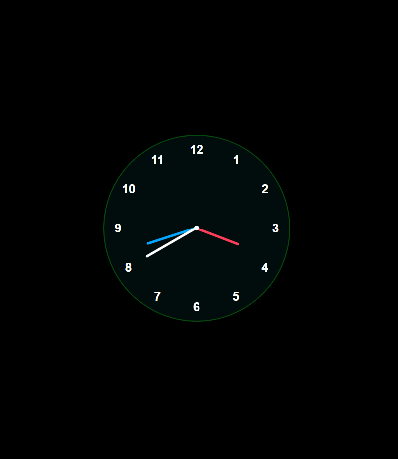

# Analog Clock

A modern and stylish **Analog Clock** built with **HTML, CSS, and JavaScript**. This project displays a functional clock with moving hour, minute, and second hands along with all 12 hour markers.

## 🔹 Preview




## 🛠 Features

- Smoothly moving hour, minute, and second hands
- Color-coded hands for better visibility
- Modern circular clock design
- Fully responsive
- Easy to customize colors, sizes, and styles

## 💻 How to Use

1. **Clone the repository**

```bash
git clone https://github.com/your-username/analog-clock.git


### Thank you [Sumon Prodhan](https://sumonprodev.wixsite.com/sumonprodhan)